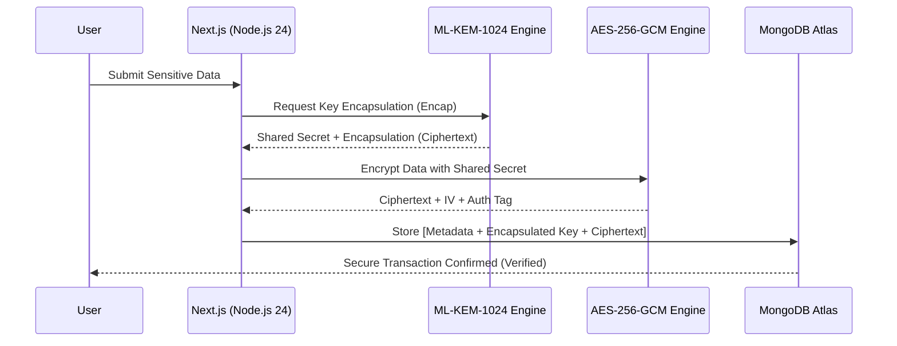

# PQMongo: Quantum-Safe MongoDB Explorer

-blue)


## Executive Summary
**"Harvest Now, Decrypt Later"** is the primary threat of the quantum era. PQMongo immunizes your sensitive MongoDB data today by implementing **ML-KEM-1024 (Module-Lattice-Based Key-Encapsulation Mechanism)**, ensuring that captured data remain unreadable even by future Cryptographically Relevant Quantum Computers (CRQCs).

## Technical Architecture

PQMongo utilizes a **Hybrid KEM/DEM (Key Encapsulation / Data Encapsulation)** flow. This combines the speed of classical symmetric encryption (AES) with the quantum-resilience of lattice-based cryptography (ML-KEM).

### 🔐 Hybrid Encryption Flow (NIST FIPS 203)



## Key Features

- **📊 Trust Dashboard**: Real-time observability for PQC tunnel health, latency, and session entropy.
- **🚀 Real-Time PQC Metrics**: Integrated Prometheus exporter at `/api/metrics` for monitoring handshake performance.
- **📁 Security Preview**: Interactive toggle in the Excel-like UI to switch between Authorized Admin (Decrypted) and Raw Database (Ciphertext) views.
- **📑 Resilience Report**: Automated PDF generation summarizing the cryptographic strength of the current session.
- **🛡️ GitHub OAuth**: Production-grade authentication for secure access control.

## Setup Guide

### Local Development
1. **Clone the Repo**:
   ```bash
   git clone https://github.com/Vishnu2707/MongoPQC.git
   cd PQMongo
   ```
2. **Install Dependencies**:
   ```bash
   npm install
   ```
3. **Environment Setup**: Create a `.env.local` with your `MONGODB_URI` and `NEXTAUTH_SECRET`.
4. **Run**:
   ```bash
   npm run dev
   ```

### Render.com Deployment
- **Plan**: Use the included `render.yaml` for a "One-Click" deployment.
- **Node Version**: Ensure Environment is set to Docker (specified `node:24-alpine` in `Dockerfile`).
- **Required Vars**: `MONGODB_URI`, `AUTH_GITHUB_ID`, `AUTH_GITHUB_SECRET`.

## Security Proof

PQMongo uses the **Lattice-based Cryptography** standard selected by NIST for Post-Quantum protection. 

| Feature | Classical (RSA/AES) | PQC (ML-KEM) | Benefit |
|---------|---------------------|--------------|---------|
| **Compliance** | FIPS 140-2 | **FIPS 203** | Future-Proof |
| **Latency** | < 0.1ms | **~0.48ms** | Negligible Overhead |
| **Entropy** | 256-bit | **1024-bit** | Quantum-Resistant |
| **Threat Profile** | Weak against Shor's | **Resistant** | Decrypt-Later Proof |

### Advanced Comparison (Radar Chart Description)
*   **Security (Classical)**: High today, Zero tomorrow.
*   **Security (PQC)**: High today, High tomorrow.
*   **Performance (Classical)**: Instant.
*   **Performance (PQC)**: High (0.4ms overhead).
*   **Packet Size (Classical)**: Small.
*   **Packet Size (PQC)**: Larger (ML-KEM-1024 encap).

## Contributing
Please see [CONTRIBUTING.md](./CONTRIBUTING.md) for our **Crypto-Agility** standards and development guidelines.

## License
MIT License - Protecting data for the Quantum Era.
